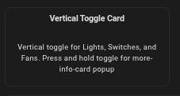
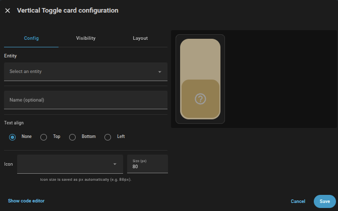

# Vertical Toggle Card

A vertical toggle card for **Lights, Switches, and Fans**.

Press and hold the toggle to open the **Home Assistant more-info popup**.

---

## Badges

[](https://hacs.xyz)
[](https://www.home-assistant.io/)
[](#installation)

---

## Features

- Vertical 2:1 ratio toggle
- Works with **light**, **switch**, and **fan** domains
- Press & hold for Home Assistant more-info popup
- Optional name placement (top / bottom / left / none)
- Edge-flush name alignment (no wasted space)
- Uses Home Assistant **computed state icons**
- Fully theme-aware
- Mobile safe
- Editor UI included

---

## Screenshots

### Add to Dashboard Picker

The card appears in Home Assistant’s **Add to Dashboard** picker for quick setup.



---

### Card Configuration Editor

The built-in visual editor allows you to configure the card without writing YAML and includes a live preview.



---

## Installation

### HACS (Recommended)

Install directly from HACS using the button below:

[](
https://my.home-assistant.io/redirect/hacs_repository/?owner=drmogie&repository=vertical-toggle-card&category=dashboard
)

#### Manual HACS steps (optional)
1. Open **HACS**
2. Go to **Frontend**
3. Open the three-dot menu (⋮) → **Custom repositories**
4. Add:
   - **Repository:** `https://github.com/drmogie/vertical-toggle-card`
   - **Category:** `Dashboard`
5. Install **Vertical Toggle Card**

---

### Add the Resource (Required)

After installing with HACS, add the Lovelace resource:

[](
https://my.home-assistant.io/redirect/lovelace_resources/
)

```yaml
resources:
  - url: /local/vertical-toggle-card/vertical-toggle-card.js
    type: module
